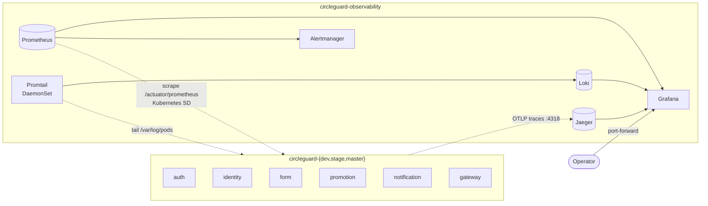

# Observability — CircleGuard

Full observability across the three pillars + alerting:

- **Metrics** — Spring Boot Actuator + Micrometer expose Prometheus metrics; an in-cluster
  Prometheus scrapes them by pod annotation; Grafana renders provisioned dashboards (incl. a
  domain/business metric). Kubernetes health probes reuse the Actuator health groups.
- **Traces** — Micrometer Tracing → OTLP → Jaeger, with context propagated across the
  inter-service REST hops.
- **Logs** — Promtail ships container logs to Loki; Grafana queries them, correlated to traces
  via the `traceId` Spring puts in every log line.
- **Alerting** — Prometheus alert rules → Alertmanager (UI; Slack-ready).

---

## Architecture



- **Discovery is annotation-based.** Prometheus runs a `role: pod` Kubernetes service-discovery
  job and keeps only pods carrying `prometheus.io/scrape: "true"`, scraping the path/port from
  `prometheus.io/path` and `prometheus.io/port`. The app Deployments declare these on their pod
  templates (port `8080`, path `/actuator/prometheus`).
- **No app-code coupling to Prometheus.** Services only depend on Actuator + the Micrometer
  Prometheus registry; the scrape contract lives entirely in annotations + Prometheus config.

---

## What's instrumented

### 1. Dependencies (shared, one place)
Added once in the root [`build.gradle.kts`](../build.gradle.kts) `subprojects` block, so all 8
services inherit them:

```kotlin
"implementation"("org.springframework.boot:spring-boot-starter-actuator")
"implementation"("io.micrometer:micrometer-registry-prometheus")
"implementation"("io.micrometer:micrometer-tracing-bridge-otel")
"implementation"("io.opentelemetry:opentelemetry-exporter-otlp")
```

### 2. Actuator config (per service `application.yml`)
Each service exposes `health,info,prometheus,metrics`, enables health **probe groups**
(`/actuator/health/liveness` and `/actuator/health/readiness`), and tags every metric with
`application=${spring.application.name}` so dashboards can group by service:

```yaml
management:
  endpoints:
    web:
      exposure:
        include: health,info,prometheus,metrics
  endpoint:
    health:
      probes:
        enabled: true
      show-details: always
  metrics:
    tags:
      application: ${spring.application.name}
```

### 3. Business metric (gateway)
[`QrValidationService`](../services/circleguard-gateway-service/src/main/java/com/circleguard/gateway/service/QrValidationService.java)
increments a Micrometer counter on every campus-gate validation, tagged by outcome:

```
circleguard_gate_validations_total{result="green"}   # access granted
circleguard_gate_validations_total{result="red"}     # denied (health risk / invalid token)
```

This is the headline panel in Grafana — it turns the core domain rule (deny entry to
`CONTAGIED`/`POTENTIAL` users) into an observable signal.

### 4. Out-of-the-box metrics
Actuator + Micrometer also export, with the `application` tag:
- `http_server_requests_seconds_{count,sum,bucket}` — request rate, latency histograms, status.
- `jvm_memory_used_bytes`, `jvm_gc_*`, `process_cpu_usage`, `system_cpu_usage`.
- `logback_events_total`, Redis/HikariCP pool gauges where applicable.

---

## Kubernetes health probes

All app Deployments (dev/stage/master) now define Actuator-backed probes:

```yaml
readinessProbe:
  httpGet: { path: /actuator/health/readiness, port: 8080 }
livenessProbe:
  httpGet: { path: /actuator/health/liveness, port: 8080 }
```

The master gateway keeps its generous `startupProbe` (it waits on Redis via an initContainer)
but now points at `/actuator/health/readiness` instead of a raw TCP check.

---

## Distributed tracing (Jaeger)

`micrometer-tracing-bridge-otel` turns each service's Observation spans into OpenTelemetry spans;
the OTLP exporter ships them to the in-cluster **Jaeger** all-in-one (`COLLECTOR_OTLP_ENABLED`),
which receives OTLP/HTTP on `:4318`. Config (per service `application.yml`, endpoint overridden in
k8s via the `MANAGEMENT_OTLP_TRACING_ENDPOINT` env from the runtime ConfigMap):

```yaml
management:
  tracing:
    sampling:
      probability: 1.0          # full sampling for the demo; lower for prod volume
  otlp:
    tracing:
      endpoint: http://localhost:4318/v1/traces
```

**Context propagation.** The inter-service REST clients
([`IdentityClient`](../services/circleguard-auth-service/src/main/java/com/circleguard/auth/client/IdentityClient.java),
auth→identity, and
[`PromotionClient`](../services/circleguard-dashboard-service/src/main/java/com/circleguard/dashboard/client/PromotionClient.java),
dashboard→promotion) were changed from `new RestTemplate()` to a `RestTemplateBuilder`-built bean
so Micrometer instruments them and injects the W3C `traceparent` header — a single trace now spans
both services. Incoming HTTP and Kafka consumers are auto-instrumented.

Open Jaeger UI: `kubectl -n circleguard-observability port-forward svc/jaeger 16686:16686`, or
explore traces inside Grafana via the provisioned Jaeger datasource.

---

## Logs (Loki + Promtail)

Manifest: [`deploy/k8s/infra/logging.yaml`](../deploy/k8s/infra/logging.yaml). **Promtail** runs as
a DaemonSet, tails `/var/log/pods` on each node, keeps only `circleguard-*` namespaces, labels each
stream with `namespace`/`pod`/`app`/`container`, and pushes to **Loki**. Grafana queries Loki via
the provisioned datasource.

Because every service now has Micrometer Tracing on the classpath, Spring Boot prefixes each log
line with `[<application>,<traceId>,<spanId>]` — so a log in Grafana/Loki can be pivoted to the
exact trace in Jaeger, closing the metrics→logs→traces loop.

Example LogQL: `{namespace="circleguard-dev", app="circleguard-gateway-service"}`.

---

## Alerting (Prometheus rules + Alertmanager)

Prometheus loads `alerts.yml` and forwards firing alerts to **Alertmanager**. Shipped rules:

| Alert | Fires when |
|---|---|
| `ServiceDown` | a `circleguard-services` target is unreachable for 1m |
| `HighHttp5xxRate` | a service serves >5% 5xx over 5m |
| `HighHttpLatencyP95` | a service's p95 latency >1s over 5m |
| `GateRedValidationSpike` | RED gate validations exceed 2× GREEN over 5m (outbreak/attack signal) |

Alertmanager ships with a no-op `default` receiver (alerts visible in its UI and the Prometheus
**Alerts** tab); a commented `slack_configs` block in `alertmanager-config` is ready to wire to a
webhook (inject it from a Secret for real use).

---

## Deploying the stack

Manifests under [`deploy/k8s/infra/`](../deploy/k8s/infra/) — both apply into the
`circleguard-observability` namespace (created by `observability.yaml`).

```bash
# 1. Namespaces, infra and apps must already be deployed.
kubectl apply -f deploy/k8s/infra/observability.yaml   # Prometheus, Grafana, Jaeger, Alertmanager
kubectl apply -f deploy/k8s/infra/logging.yaml         # Loki + Promtail

# 2. Wait for the pods.
kubectl -n circleguard-observability rollout status deploy/prometheus
kubectl -n circleguard-observability rollout status deploy/grafana
kubectl -n circleguard-observability rollout status deploy/jaeger
kubectl -n circleguard-observability rollout status deploy/loki

# 3. Open the UIs (no Ingress is shipped — use port-forward).
kubectl -n circleguard-observability port-forward svc/grafana 3000:3000        # admin/admin
kubectl -n circleguard-observability port-forward svc/prometheus 9090:9090
kubectl -n circleguard-observability port-forward svc/jaeger 16686:16686
kubectl -n circleguard-observability port-forward svc/alertmanager 9093:9093
```

In Prometheus → **Status → Targets** you should see the `circleguard-services` job with one
target per app pod, all `UP`. In Grafana the **CircleGuard → Overview** dashboard is
auto-provisioned (datasource + dashboard, no manual import).

### Dashboard panels
| Panel | Query |
|---|---|
| Gate validations / sec (business) | `sum(rate(circleguard_gate_validations_total[5m])) by (result)` |
| Total gate validations | `sum(circleguard_gate_validations_total) by (result)` |
| HTTP request rate by service | `sum(rate(http_server_requests_seconds_count[5m])) by (application)` |
| HTTP p95 latency by service | `histogram_quantile(0.95, sum(rate(http_server_requests_seconds_bucket[5m])) by (le, application))` |
| HTTP 5xx rate by service | `sum(rate(http_server_requests_seconds_count{status=~"5.."}[5m])) by (application)` |
| JVM heap by service | `sum(jvm_memory_used_bytes{area="heap"}) by (application)` |
| Targets up | `up{job="circleguard-services"}` |

---

## Verifying locally (without a cluster)

The metrics endpoint works on a plain `bootRun`/`bootJar`:

```bash
# (CI Linux — local JVM build is blocked in this dev env, see HANDOFF.md §4)
./gradlew :services:circleguard-gateway-service:bootJar
java -jar services/circleguard-gateway-service/build/libs/*.jar &
curl localhost:8087/actuator/health/readiness     # {"status":"UP"}
curl localhost:8087/actuator/prometheus | grep circleguard_gate_validations
```

Drive a couple of validations against `POST /api/v1/gate/validate` and the
`circleguard_gate_validations_total` counter increments by `result`.

---

## Production notes
- **Storage is `emptyDir`** (ephemeral) across Prometheus, Grafana, Jaeger, Loki and Alertmanager
  so the manifests apply on any cluster. For durable data, swap to PVCs on a `gp3` StorageClass —
  the EKS Terraform module already installs the `aws-ebs-csi-driver` addon. Retention is capped
  (Prometheus 3d, Loki 72h) and Jaeger all-in-one keeps traces in memory.
- **Grafana admin is `admin/admin`** — override `GF_SECURITY_ADMIN_PASSWORD` (ideally from a
  Secret) before any non-demo use.
- **Sampling is 1.0** (every request traced) — lower `management.tracing.sampling.probability`
  (via `MANAGEMENT_TRACING_SAMPLING_PROBABILITY`) under real load.
- For HA / long-term storage consider `kube-prometheus-stack` (Helm) with Thanos/Mimir, the Jaeger
  Operator with Elasticsearch (or Grafana Tempo), and the Loki Helm chart on S3 (IRSA-backed). This
  hand-rolled stack is intentionally minimal and review-friendly.

---

## Roadmap
The three pillars + alerting are in place. Possible follow-ups:
- **RED/USE dashboards** per service and an SLO/error-budget dashboard.
- **Trace exemplars** linking Prometheus latency histograms directly to sample traces in Jaeger.
- **Alert delivery** wired to a real Slack/email receiver (currently a no-op receiver + UI).
- **Synthetic checks** (blackbox-exporter) for external-facing endpoints.
