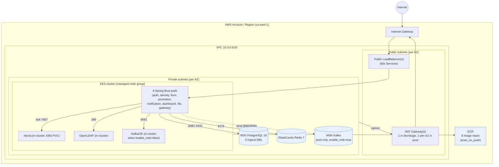
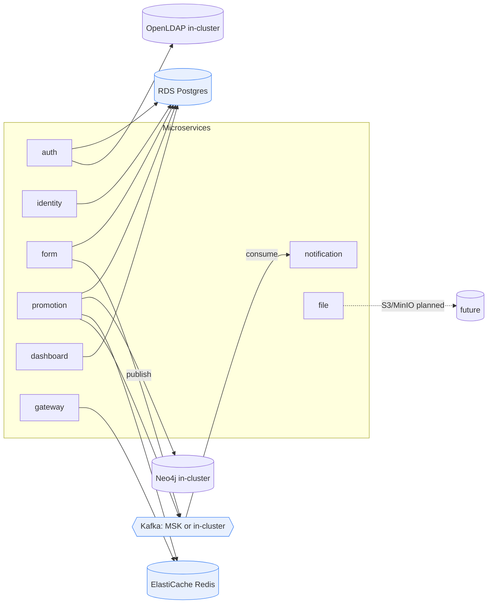
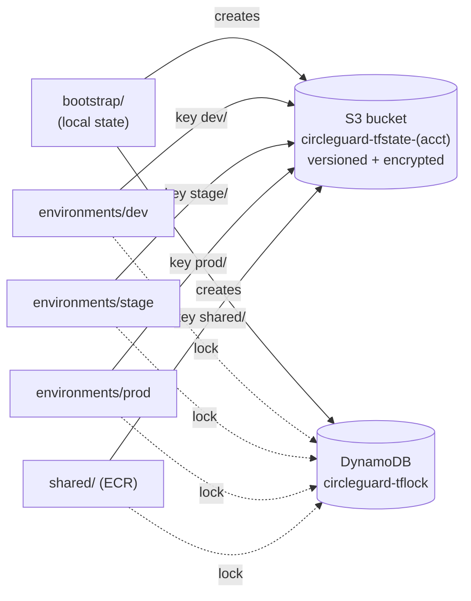

# CircleGuard AWS Infrastructure — Architecture

Two views: the **AWS resource topology** Terraform provisions, and the **logical mapping**
of the 8 microservices to their data stores. Diagrams are Mermaid so they render directly in
GitHub / VS Code; export to PNG for the presentation if needed.

## 1. AWS resource topology

Security groups: RDS (5432), ElastiCache (6379) and MSK (9092/9094) ingress is restricted to
the **EKS cluster security group** only — no public access. State lives in an S3 bucket
(versioned, encrypted, private) with a DynamoDB lock table.

## 2. Logical service → store mapping

## Environment sizing matrix

| Variable | dev | stage | prod (`master`) |
|---|---|---|---|
| AZs | 1 | 2 | 3 |
| `single_nat_gateway` | true | true | false |
| `node_instance_types` | t3.medium | t3.medium | t3.large |
| node desired/min/max | 2 / 1 / 3 | 2 / 2 / 4 | 3 / 3 / 6 |
| `capacity_type` | SPOT | SPOT | ON_DEMAND |
| `rds_instance_class` | db.t4g.micro | db.t4g.micro | db.t4g.small |
| `rds_multi_az` | false | false | true |
| `redis_node_type` | cache.t4g.micro | cache.t4g.micro | cache.t4g.small |
| `redis_num_nodes` / failover | 1 / off | 1 / off | 2 / on |
| `enable_msk` | false | false | true |

## State backend

